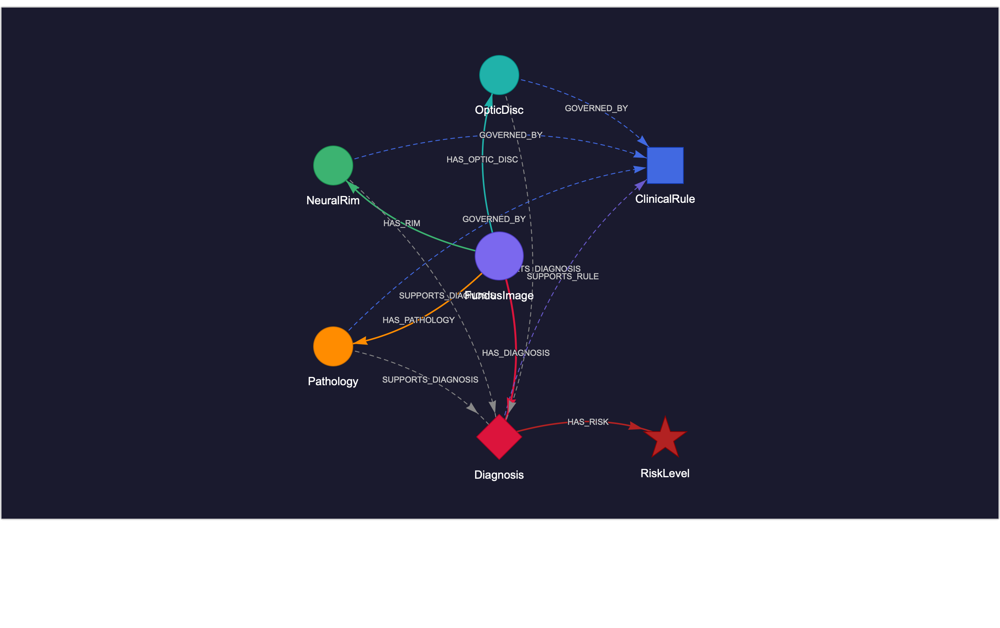

# GlaKG: A Biomarker-Centric Fundus Knowledge Graph for Explainable Glaucoma Diagnosis and Risk Assessment

[](https://www.python.org/)
[](https://pytorch.org/)
[](LICENSE)
[]()

> Official implementation of **GlaKG**, a biomarker-centric fundus knowledge graph for explainable glaucoma diagnosis and risk stratification, submitted to IEEE BIBM 2026.

---

## Overview

GlaKG integrates structural biomarkers, clinical rules, and fundus image features into a unified knowledge graph, providing interpretable reasoning chains for every glaucoma diagnosis.

<p align="center">
  
  <br>
  <em>Figure 1: GlaKG entity-relation schema</em>
</p>

### Key Features

- **6 entity types**: FundusImage, OpticDisc, NeuralRim, Pathology, Diagnosis, RiskLevel
- **8 relation types**: structural + inference edges
- **11 clinical rules**: CDR threshold, ISNT rule, rim thinning, bayoneting, notching, and more
- **KG-fusion inference**: combines ResNet50 image embeddings with KG reasoning chain scores
- **Dual-task evaluation**: binary glaucoma classification + four-class risk stratification
- **Explainable reasoning chains**: every prediction linked to activated clinical rules

---

## Results

### Binary Glaucoma Classification

| Method | Acc | Prec | Rec | F1 | AUC |
|--------|-----|------|-----|----|-----|
| LR (img only) | 0.8854 | 0.8945 | 0.9250 | 0.9094 | 0.9417 |
| RF (img only) | 0.8723 | 0.8388 | 0.9836 | 0.9053 | 0.9423 |
| GB (img only) | 0.8869 | 0.8771 | 0.9509 | 0.9124 | 0.9487 |
| MLP (img only) | 0.8767 | 0.8811 | 0.9274 | 0.9029 | 0.9417 |
| GCN | 0.9072 | 0.9277 | 0.9227 | 0.9247 | 0.9641 |
| GAT | 0.9710 | 0.9555 | 1.0000 | 0.9772 | 0.9912 |
| **Ours (α=0.5)** | **0.9942** | **1.0000** | **0.9906** | **0.9953** | **0.9988** |

### Risk Stratification (4-class)

| Method | Acc | F1 (macro) | F1 (weighted) | AUC |
|--------|-----|------------|---------------|-----|
| Best baseline | 0.8316 | 0.5343 | 0.8230 | 0.7752 |
| **Ours (α=0.5)** | **0.9303** | **0.6127** | **0.9222** | **0.8010** |

---

## Repository Structure

```
GlaKG/
├── Dataset/
│   └── Data/
│       ├── train-00000-of-00001.parquet
│       └── test-00000-of-00001.parquet
├── kg_output/                    # Generated KG files and figures
│   ├── kg_nodes.csv
│   ├── kg_edges.csv
│   ├── fig1_schema_v2.html
│   ├── fig2_case_v2.html
│   └── fig3_overview_v2.html
├── data_preprocessing.ipynb      # KG construction pipeline
├── parse_glaucoma_kg.py          # Parquet → KG triples parser
├── import_to_neo4j.cypher        # Neo4j import script (optional)
├── kg_statistics_cells.py        # Graph statistics analysis
├── clinical_rules_cells.py       # Clinical rule encoding
├── kg_visualization_cells.py     # KG visualization (pyvis)
├── classification_image_cells.py # Image-based classification
├── classification_risk_cells.py  # Risk stratification
├── xai_cells_v2.py               # Feature importance analysis
├── error_analysis_cells.py       # Error analysis
├── gnn_cells.py                  # GCN / GAT experiments
└── README.md
```

---

## Installation

```bash
# Clone the repository
git clone https://github.com/your-username/GlaKG.git
cd GlaKG

# Create conda environment
conda create -n KGG python=3.10
conda activate KGG

# Install dependencies
pip install pandas pyarrow networkx pyvis matplotlib seaborn scikit-learn
pip install torch torchvision --index-url https://download.pytorch.org/whl/cpu
pip install torch-geometric
```

---

## Quick Start

### Step 1: Parse parquet → KG triples

```bash
python parse_glaucoma_kg.py Dataset/Data/ --out kg_output/
```

### Step 2: Run statistics analysis

Open and run `kg_statistics_cells.py` in Jupyter notebook.

### Step 3: Encode clinical rules

Open and run `clinical_rules_cells.py` in Jupyter notebook.

### Step 4: Visualize the KG

Open and run `kg_visualization_cells.py` in Jupyter notebook.
Open the generated HTML files in your browser:
- `kg_output/fig1_schema_v2.html` — Schema graph
- `kg_output/fig2_case_v2.html` — Single case reasoning chain
- `kg_output/fig3_overview_v2.html` — Overview graph

### Step 5: Run classification experiments

```python
# Image-based classification + KG fusion
# Run classification_image_cells.py in Jupyter

# Risk stratification
# Run classification_risk_cells.py in Jupyter

# GNN experiments
# Run gnn_cells.py in Jupyter
```

---

## Knowledge Graph Statistics

| Metric | Value |
|--------|-------|
| Total nodes | 4,557 |
| Total edges | 18,423 |
| Node types | 6 |
| Edge types | 8 |
| Clinical rules | 11 |
| Graph density | 1.98 × 10⁻⁴ |
| Largest CC ratio | 0.9991 |
| Avg rules per diagnosis | 5.83 |
| KG feature contribution | 51.1% |

---

## Case Explanation Example

GlaKG provides an interpretable reasoning chain for every prediction:

```
Case     : acrima_glaucoma_57.png
CDR      : 0.8
ISNT     : violated
Rim thin : yes
Notching : yes
Chain score: 18  (strong=3, moderate=2, weak=1)

Activated rules (6):
  [strong  ] CDR high risk threshold
  [strong  ] Rim thinning rule
  [strong  ] ISNT rule violation
  [moderate] Bayoneting + notching co-occurrence
  [moderate] Bayoneting sign
  [moderate] Notching sign
```

---

## Citation

If you find this work useful, please cite:

```bibtex
@inproceedings{huang2026glakg,
  title     = {GlaKG: A Biomarker-Centric Fundus Knowledge Graph for
               Explainable Glaucoma Diagnosis and Risk Assessment},
  author    = {Huang, Cheng},
  booktitle = {Proceedings of the IEEE International Conference on
               Bioinformatics and Biomedicine (BIBM)},
  year      = {2026}
}
```

---

## License

This project is licensed under the MIT License. See [LICENSE](LICENSE) for details.

---

## Acknowledgements

This work was supported by the Quantitative Biomedical Research Center (QBRC) at UT Southwestern Medical Center. The authors thank the clinical collaborators at UTSW Ophthalmology for their valuable feedback.
